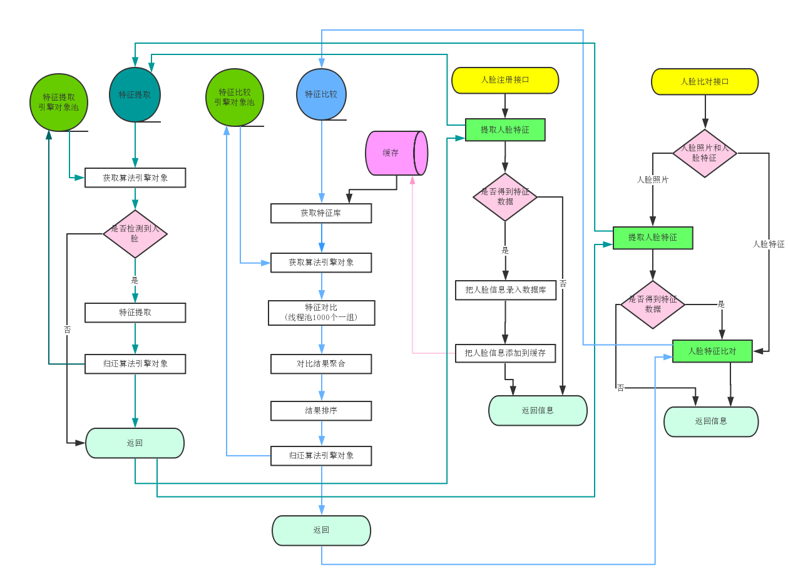

## 开发环境准备：
###开发使用到的软件和工具：
* Jdk8、mysql5.7、libarcsoft_face.dll(so)、libarcsoft_face_engine.dll(so)、libarcsoft_face_engine_jni.dll(so)、idea
* 注：libarcsoft_face.dll(so)、libarcsoft_face_engine.dll(so)、app-id、sdk-key可以到虹软官网 http://ai.arcsoft.com.cn/ 免费申请下载

* 本地配置：
	* 配置环境(推荐jdk8，mysql5.7，maven3，idea)
    * 引擎库libarcsoft_face、libarcsoft_face_engine、libarcsoft_face_engine_jni。把dll或so文件拷贝到java.library.path所包含的路径下,注意区分X86和X64，和当前jdk版本一致。
  
* 初始化项目
创建数据库arcsoft_face_demo，执行脚本arcsoft_face_demo.sql

* 使用idea启动项目
    * 修改配置文件src\main\resources\application.properties
        * 填写数据库datasource的url、username和password
        * 填写freesdk的app-id和sdk-key。
 
* 启动项目
    * 在com.arcsoft.facedemo包下，右击Application，选择Run ‘Application’
 

* 项目访问地址
    * http://127.0.0.1:8080/demo

### 项目流程图
 

