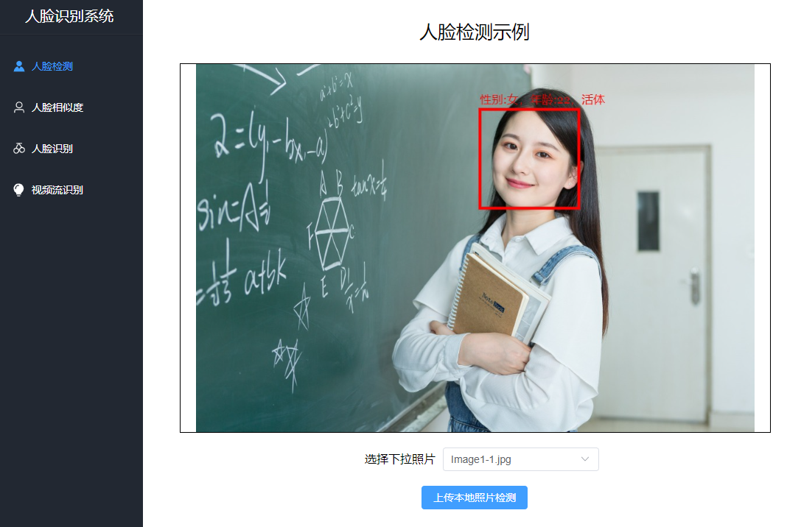

## 开发环境准备：

### 代码：
* 免费版v3.0使用master分支
* 增值版v4.1使用arcface_pro分支

### 开发使用到的软件和工具：

* Jdk8、libarcsoft_face.dll(so)、libarcsoft_face_engine.dll(so)、libarcsoft_face_engine_jni.dll(so)、idea
* 注：libarcsoft_face.dll(so)、libarcsoft_face_engine.dll(so)、libarcsoft_face_engine_jni.dll(so)
  、app-id、sdk-key可以到虹软官网 http://ai.arcsoft.com.cn/ 免费申请下载

* 本地配置：
    * 配置环境(推荐jdk8，maven3，idea)
    * 引擎库libarcsoft_face、libarcsoft_face_engine、libarcsoft_face_engine_jni。注意区分X86和X64，和当前jdk版本一致。

* 初始化项目
* 使用idea启动项目
    * 修改配置文件src\main\resources\application.properties
        * 填写人脸识别id：config.arcface-sdk.app-id
        * 填写人脸识别key：config.arcface-sdk.sdk-key
    * 替换src\main\resources\libs\3.0下面的库文件
    * 检查pom.xml文件的<properties>中的<javacv.platform>配置是否与当前操作系统匹配，注：如需要打包成在linux上运行，需将配置切换到 *linux-x86_64*，然后进行打包

* 启动项目
    * 在com.arcsoft.facedemo包下，右击Application，选择Run ‘Application’

* 项目访问地址
    * http://127.0.0.1:8089/

* 项目体验访问地址
    * http://itboyst.vicp.cc:8089/

* 后端使用springboot+javacv，前端使用vue3，支持人脸检测，人脸比对，人脸识别，本地视频识别，rtsp视频流识别等，代码易读精简

* 前端代码：
    * https://github.com/itboyst/ArcSoftFaceDemoUI

* 项目截图：
    * 

* 微信打赏：
    * 
